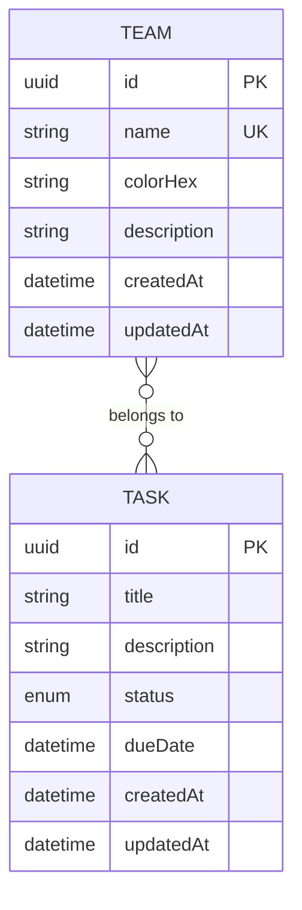

# Management API

API REST em Node.js, NestJS, TypeScript, Prisma e PostgreSQL para gerenciar times e tarefas.

Este repositório cobre a parte de back-end do desafio: CRUD de times, CRUD de tarefas, relacionamento de uma tarefa com zero ou mais times, filtros, ordenação, paginação, seed e documentação de execução.

## Stack

- Node.js 24.17.0 via `nvm`
- NestJS 11
- PostgreSQL 16
- Prisma 6.19
- Jest + Supertest

## Decisões arquiteturais

Escolhi PostgreSQL porque o domínio é relacional: tarefas podem estar vinculadas a vários times e times podem participar de várias tarefas. Esse relacionamento muitos-para-muitos fica explícito e consistente no banco, com integridade referencial e boa base para filtros por `teamId`.

Usei Prisma como ORM por três motivos: migrations versionadas, seed reprodutível e um client tipado que deixa o contrato entre aplicação e banco mais claro. A aplicação fica organizada em camadas simples:

- `Controller`: recebe HTTP, valida DTOs e expõe os endpoints REST.
- `Service`: concentra regras de aplicação, montagem de filtros e validações de relacionamento.
- `PrismaService`: encapsula acesso ao banco.
- `DTOs`: definem validações de payload e query string com `class-validator`.

As respostas seguem o envelope sugerido pelo enunciado:

```json
{
  "data": {},
  "meta": {}
}
```

Erros seguem:

```json
{
  "error": {
    "code": "BAD_REQUEST",
    "message": "Validation failed.",
    "details": []
  }
}
```

## Modelo de dados



Status possíveis de uma tarefa:

- `PENDING`
- `IN_PROGRESS`
- `DONE`

## Como rodar localmente

Use Node atualizado com `nvm`:

```bash
nvm install
nvm use
```

Instale as dependências:

```bash
npm install
```

Suba o PostgreSQL:

```bash
docker compose up -d
```

Crie o arquivo de ambiente:

```bash
cp .env.example .env
```

Rode migrations e seed:

```bash
npm run db:migrate
npm run seed
```

Inicie a API:

```bash
npm run start:dev
```

A API ficará disponível em:

```text
http://localhost:3000/api
```

## Scripts

- `npm run start:dev`: inicia a API em modo desenvolvimento.
- `npm run build`: compila o projeto.
- `npm run start:prod`: executa o build.
- `npm run deploy:start`: aplica migrations pendentes e inicia o build compilado.
- `npm run db:migrate`: aplica migrations em desenvolvimento.
- `npm run db:deploy`: aplica migrations em ambiente não interativo.
- `npm run seed`: recria dados iniciais.
- `npm test`: roda testes unitários.
- `npm run test:e2e`: aplica migrations no banco de teste e roda testes de integração HTTP.

O `docker-compose.yml` cria dois bancos: `management_api` e `management_api_test`.

## Deploy free com Render + Neon

Este projeto já inclui um `render.yaml` para facilitar o deploy da API no Render usando um banco PostgreSQL externo no Neon.

### 1. Criar banco no Neon

1. Crie uma conta em https://neon.tech.
2. Crie um projeto PostgreSQL free.
3. Copie a connection string direta do banco.
4. Use essa connection string como `DATABASE_URL` no Render.

Para Prisma, prefira a connection string direta do Postgres. Se o painel mostrar uma opção pooled e outra direct, use a direct para este desafio.

### 2. Publicar o repositório no GitHub

O Render faz deploy a partir de um repositório Git. Depois de subir este projeto para o GitHub, conecte o repositório no Render.

### 3. Criar Web Service no Render

No Render:

1. Clique em `New`.
2. Escolha `Blueprint` se quiser usar o `render.yaml`; ou `Web Service` para configurar manualmente.
3. Conecte o repositório.
4. Configure a variável de ambiente:

```env
DATABASE_URL=postgresql://...
```

Com o `render.yaml`, os comandos ficam:

```bash
npm ci && npm run db:generate && npm run build
```

```bash
npm run deploy:start
```

Healthcheck:

```text
/api/health
```

### 4. Popular dados de demonstração

O seed não roda automaticamente no start do deploy porque ele recria os dados. Depois do primeiro deploy, rode uma vez:

```bash
npm run seed
```

Se o plano free do Render não liberar shell/one-off job, rode o seed localmente apontando para o banco do Neon:

```bash
DATABASE_URL="postgresql://..." npm run seed
```

### Observações do plano free

- Render free pode dormir depois de alguns minutos sem tráfego; a primeira chamada depois disso pode demorar.
- Neon free é suficiente para avaliação e protótipo, mas não deve ser tratado como ambiente de produção crítico.

## Endpoints REST

### Times

#### Listar times

```bash
curl "http://localhost:3000/api/teams?limit=10&offset=0&search=eng"
```

#### Buscar time por id

```bash
curl "http://localhost:3000/api/teams/{teamId}"
```

#### Criar time

```bash
curl -X POST "http://localhost:3000/api/teams" \
  -H "Content-Type: application/json" \
  -d '{
    "name": "Engenharia",
    "colorHex": "#16A34A",
    "description": "Responsavel por arquitetura e implementacao."
  }'
```

#### Atualizar time

```bash
curl -X PUT "http://localhost:3000/api/teams/{teamId}" \
  -H "Content-Type: application/json" \
  -d '{
    "name": "Engenharia Plataforma",
    "colorHex": "#0F766E"
  }'
```

#### Deletar time

```bash
curl -X DELETE "http://localhost:3000/api/teams/{teamId}"
```

### Tarefas

#### Listar tarefas

Filtros suportados:

- `teamId`
- `status`
- `search`
- `limit`
- `offset`
- `sort`

Campos aceitos em `sort`: `createdAt`, `updatedAt`, `dueDate`, `title`, `status`.

```bash
curl "http://localhost:3000/api/tasks?teamId={teamId}&status=PENDING&search=api&limit=10&offset=0&sort=createdAt:desc"
```

#### Buscar tarefa por id

```bash
curl "http://localhost:3000/api/tasks/{taskId}"
```

#### Criar tarefa

```bash
curl -X POST "http://localhost:3000/api/tasks" \
  -H "Content-Type: application/json" \
  -d '{
    "title": "Criar API REST",
    "description": "Implementar CRUD de times e tarefas.",
    "status": "PENDING",
    "dueDate": "2026-07-01T12:00:00.000Z",
    "teamIds": ["{teamId}"]
  }'
```

`teamIds` pode ser omitido ou enviado como lista vazia para criar uma tarefa sem time vinculado.

#### Atualizar tarefa

```bash
curl -X PUT "http://localhost:3000/api/tasks/{taskId}" \
  -H "Content-Type: application/json" \
  -d '{
    "title": "Criar API REST documentada",
    "status": "IN_PROGRESS",
    "teamIds": ["{teamId}"]
  }'
```

Ao enviar `teamIds` no `PUT`, os vínculos anteriores são substituídos pela lista enviada.

#### Alterar status rapidamente

```bash
curl -X PATCH "http://localhost:3000/api/tasks/{taskId}/status" \
  -H "Content-Type: application/json" \
  -d '{
    "status": "DONE"
  }'
```

#### Deletar tarefa

```bash
curl -X DELETE "http://localhost:3000/api/tasks/{taskId}"
```

## Seed

O seed recria dados de avaliação rápida:

- 3 times: Produto, Engenharia e Design.
- 10 tarefas em diferentes status.
- Tarefas com um time, múltiplos times e uma tarefa sem time.

Para rodar novamente:

```bash
npm run seed
```

## Testes

Testes unitários:

```bash
npm test
```

Testes de integração HTTP com PostgreSQL:

```bash
docker compose up -d
npm run test:e2e
```

## O que faria diferente em produção

- Autenticação e autorização por usuário/organização.
- Rate limit e proteção mais rígida de CORS.
- Observabilidade com logs estruturados, tracing e métricas.
- Paginação por cursor para listas muito grandes.
- Busca com índice dedicado, por exemplo `pg_trgm` ou OpenSearch.
- Pipeline de CI rodando migrations, testes unitários e e2e.
- Deploy com migrations automatizadas e estratégia de rollback.
- Variáveis sensíveis em secret manager, nunca em arquivos versionados.
